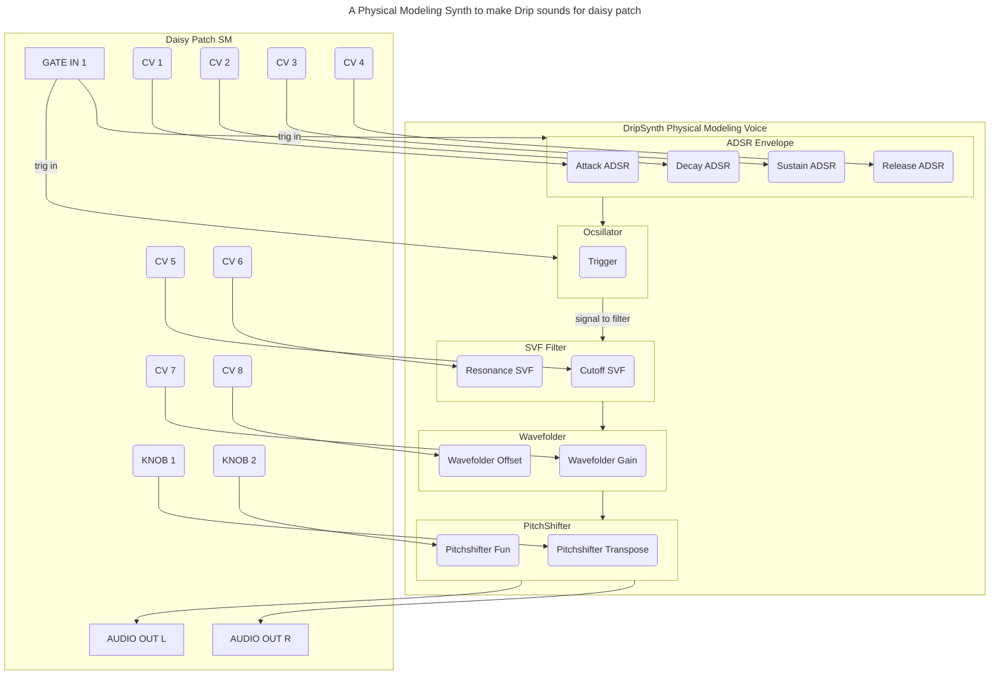

# DripSynth

DripSynth is a physical modeling synthesizer for the Daisy Patch SM. It uses the `Drip` physical modeling voice to create percussive, water-like sounds, which are then processed through a filter and a chain of effects.

## Features

*   **Voice**: `Drip` physical modeling voice.
*   **Filter**: State-Variable Filter (`SVF`) with low-pass output.
*   **Envelope**: `ADSR` envelope to shape the sound.
*   **Effects**:
    *   `Wavefolder`
    *   `Pitch Shifter`

## Controls

| Control         | Parameter              | Description                                      |
| --------------- | ---------------------- | ------------------------------------------------ |
| **GATE IN 1**   | Trigger                | Triggers the `Drip` voice and the `ADSR` envelope. |
| **CV 1**        | ADSR Attack            | Sets the attack time of the envelope (0.001s to 4s).            |
| **CV 2**        | ADSR Decay             | Sets the decay time of the envelope (0.001s to 4s).             |
| **CV 3**        | ADSR Sustain           | Sets the sustain level of the envelope (0-1).          |
| **CV 4**        | ADSR Release           | Sets the release time of the envelope (0.001s to 4s).           |
| **CV 5**        | Filter Cutoff          | Sets the cutoff frequency of the SVF filter (20Hz-20kHz).     |
| **CV 6**        | Filter Resonance       | Sets the resonance of the SVF filter (0-0.95).            |
| **CV 7**        | Wavefolder Gain        | Controls the amount of wavefolding (0-10).              |
| **CV 8**        | Wavefolder Offset      | Sets the offset of the wavefolder (-0.8 to 0.8).               |
| **KNOB 1**      | Pitch Shifter Transpose| Transposes the pitch of the sound (-12 to +12 semitones).               |
| **KNOB 2**      | Pitch Shifter Fun      | Controls the "fun" parameter of the pitch shifter (0-1).|

## Signal Flow



## Building and Uploading

To build and upload the DripSynth to your Daisy Patch SM, follow these steps:

1.  Navigate to the `patch_sm/DripSynth` directory:
    ```bash
    cd patch_sm/DripSynth
    ```

2.  Build the project:
    ```bash
    make
    ```

3.  Upload the program to the Daisy Patch SM:
    ```bash
    make program-dfu
    ```

## Trigger/Gate Input

The `GATE IN 1` input is designed to accept standard Eurorack-level trigger or gate signals.

*   **Signal Type**: It works with both short triggers and longer gates.
    *   A **trigger** will fire the sound once.
    *   A **gate** will fire the sound and hold the envelope open until the gate goes low.
*   **Voltage Level**: The input expects a voltage of approximately **+5V or higher** to register as a high signal.
*   **Audio as Trigger**: Using an audio signal as a trigger is not recommended. It will cause the sound to re-trigger at audio rates, resulting in a noisy, unpredictable output.

## Audio Output

The audio output is sent to the `AUDIO_OUT_L` and `AUDIO_OUT_R` jacks on the Daisy Patch SM, which correspond to pins `B2` and `B1` respectively. No additional code is required to enable the audio output.

## Unit Testing

While not included in this project, here are some suggestions for unit tests that would be appropriate for the DripSynth:

*   **Module-Level Tests**:
    *   **`Drip` Voice**:
        *   Verify that `Process(true)` produces a sound with the expected characteristics (e.g., a decaying sine-like waveform).
        *   Confirm that `Process(false)` after a trigger results in a decaying sound that eventually becomes silent.
    *   **`ADSR` Envelope**:
        *   Test that the envelope generator correctly follows the Attack, Decay, Sustain, and Release phases.
        *   Ensure that the output values are always within the expected 0.0 to 1.0 range.
    *   **`SVF` Filter**:
        *   Verify that the low-pass output correctly attenuates frequencies above the cutoff frequency.
        *   Test that the resonance control behaves as expected, creating a peak at the cutoff frequency.

*   **Integration Tests**:
    *   Test the entire audio signal chain by providing a trigger signal and analyzing the output to ensure it has the expected characteristics.
    *   Verify the control mappings by setting mock ADC values and checking that the corresponding parameters in the DSP modules are updated correctly.

## Appendix: Control Scaling Philosophy

The raw 0.0 to 1.0 output of a CV input or knob is rarely the most musically expressive range for a parameter. To make the DripSynth more playable and intuitive, the control ranges have been carefully scaled.

*   **ADSR Times (`Attack`, `Decay`, `Release`)**: A linear 0-1 second range is not ideal. For percussive sounds, very short envelope times are needed, while ambient sounds require much longer times. By mapping the input to a range of **0.001 to 4 seconds**, the DripSynth can produce both snappy, clicky envelopes and long, evolving soundscapes.

*   **Filter Resonance**: The `Svf` filter can self-oscillate loudly and harshly when the resonance is set to 1.0. To prevent sudden, unpleasant volume spikes and make the resonance more controllable, the maximum value has been capped at **0.95**. This keeps the filter's behavior in a more musical "sweet spot".

*   **Wavefolder Offset**: The offset parameter shifts the waveform before it enters the wavefolder, which alters the harmonic content of the resulting sound. A bipolar range is more useful here, as it allows for a wider variety of timbres. The input is mapped to a **-0.8 to +0.8** range, providing a more diverse sonic palette.

*   **Pitch Shifter Transposition**: The ability to pitch a sound both up and down is essential for musical applications. The original 0 to +24 semitone range has been changed to **-12 to +12 semitones**, allowing for one octave of pitch shifting in either direction.